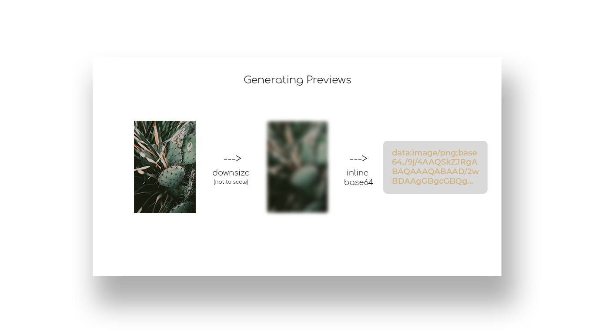

# kennysexton.com

My personal website. Built using [Next.js](https://nextjs.org/)

## Run locally

`npm run dev`

## Lazy Loading

  

So many photos, that's a lot of bits! Thankfully Next.js has a lot of built in optimizations for loading images. One of which is the ability to [show a placeholder](https://nextjs.org/docs/app/api-reference/components/image#placeholder) while the image is loading.

In order to handle generating these placeholders I wrote a [python script](https://github.com/kennysexton/kennysexton.com/blob/main/public/homepage-images/downscale.py) that will fetch the images at the source, downscale, and perform a Base64 encode to get a very low res preview that is shown using Next.js' built in blurring.

## Past Versions

[2018-2024](https://github.com/kennysexton/website.v2)

[2017](https://github.com/kennysexton/website.v1)
